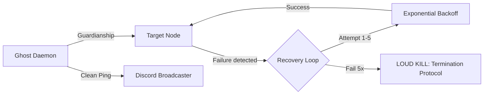

# 👻 THE GHOST DAEMON v1.0
## [Sovereign Watchdog & Tunneling Manager]

[](docs/SQA_v5.md)
[](systemd/ghost.service)
[](docs/DEFINITIONS.md)

The **Ghost Daemon** is a low-footprint, bit-hardened process guardian designed to ensure 100% uptime for the Trishula Autonomous Regime's core mission nodes. It manages sovereign ngrok tunnels, PID lockfiles, and executes "Clean Ping" broadcast protocols during high-stakes mission windows.

---

## █ SOVEREIGN VIGILANCE
The Ghost Daemon operates on a zero-manual-intervention policy. It monitors the heartbeat of your execution nodes and performs deterministic recovery without human oversight.



### Operational Protocols:
- **Clean Ping**: Distraction-free telemetry broadcasts (coordinates only).
- **PID-Lock**: Atomic guardianship preventing duplicate node collision.
- **Loud Kill**: Final termination procedure and alert sequence upon unrecoverable node failure.

---

## █ CORE DEFINITIONS
*For a full technical glossary, see [DEFINITIONS.md](docs/DEFINITIONS.md).*

- **The Watchdog**: The primary monitoring thread overseeing PID health.
- **Exponential Backoff**: 5-stage recovery timing (5s, 10s, 20s, 40s, 80s).
- **Clean Pulse**: A regular heartbeat signal confirming the Sovereign Tunnel is active.

---

## █ INFRASTRUCTURE
- **Engine**: Python 3.11 with `psutil` integration.
- **Broadcaster**: High-availability `httpx` logic for Discord synchronization.
- **Guardianship**: Atomic `.pid` file lock management.

---

## █ DEPLOYMENT

### Systemd (Institutional Standard)
```bash
# SQA_v5 compliant service installation
sudo cp systemd/ghost.service /etc/systemd/system/
sudo systemctl daemon-reload
sudo systemctl enable ghost.service
sudo systemctl start ghost.service
```

### Local Manual Guard
```bash
python ghost_daemon.py --target my_node.py --pid-life 300
```

---

## █ REGIME WORKFLOWS
Ghost-Daemon utilizes the universal Trishula CI/CD suite. See [WORKFLOWS.md](docs/WORKFLOWS.md) for details.

- **Ghost Shift**: Automatic deployment and self-healing validation.
- **Sentinel Weld**: Merkle-parity check of the recovery logic.

---
**PROPERTY OF TRISHULA SOFTWARE — LEVEL 5 SOVEREIGNTY ENFORCED**
